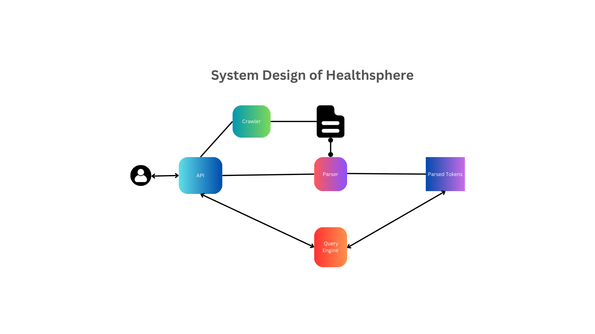
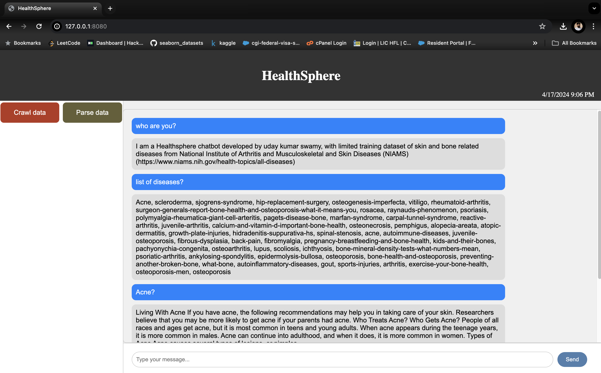
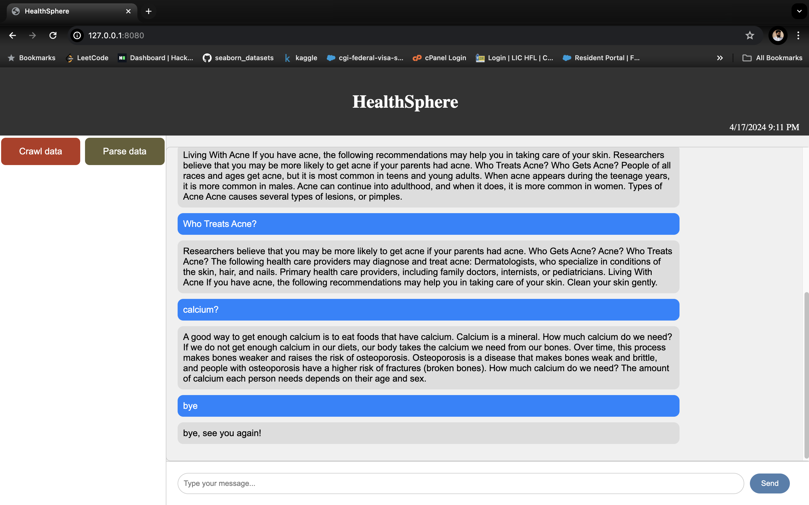

<h1 align="center">  CS 429: INFORMATION RETRIEVAL: HEALTHSPHERE (COURSE PROJECT)
</h1>

# healthsphere chatbot description:
The HealthSphere chatbot is a Python-based application developed using Flask, NLTK (Natural Language Toolkit), and various web technologies such as HTML, CSS, and JavaScript. Its primary purpose is to provide information and assistance related to skin and bone-related diseases.

Key Features:

Python: The backend logic of the chatbot is implemented in Python. It leverages libraries such as NLTK for natural language processing tasks.

Flask: The web application framework Flask is used to build the chatbot's web interface. Flask provides routing, templating, and other functionalities necessary for web development.

NLTK: The chatbot utilizes NLTK for natural language processing tasks, including tokenization, lemmatization, and semantic analysis. NLTK helps the chatbot understand and respond to user queries effectively.

HTML, CSS, JavaScript: The frontend of the chatbot is designed using HTML for structure, CSS for styling, and JavaScript for interactive elements. This ensures a user-friendly and visually appealing interface.

Skin and Bone-related Diseases: The chatbot specializes in providing information and support related to skin and bone-related diseases. It can answer queries, provide relevant resources, and offer assistance to users seeking information about these specific health conditions.


### programming language used : Python, nltk, flask, HTML, css, JavaScript


# contributors
- [Uday kumar swamy (A20526852)](https://github.com/udaykumarswamy)


# pre-requisites for mac-os/windows

- These are all the required libraries to run the application, please run the below command to install the libraries
```bash
pip install -r requirements.txt
```

# Steps to Run the Code

Follow these steps to run the HealthSphere Chatbot code:

### Step 1: Navigate to the HealthSphere Folder

Go to the "healthsphere" folder located in the Step 1 location.

### Step 2: Run the Flask Application

Open a terminal or command prompt, navigate to the "healthsphere" folder, and run the following command:

```bash
python app.py
```
### Step 3: Access the Web Application
Open your web browser and enter the following URL in the address bar:
```
http://127.0.0.1:8080/
```

### Step 4: Crawl Data
Once the web application is open in your browser, click on the "Crawl Data" button.

### Step 5: Parse Data
After crawling the data, click on the "Parse Data" button to parse the crawled data.

### Step 6: Query the Engine
You can now type your message and press Enter in the chatbox to query the HealthSphere chatbot engine.
<p>
 
</p>
<br>

# System Design 


## Components Description
-----
In this section i will be describing the 3 components used in this application
- Crawler
- Parser
- Query Engine

# Crawler Components Description

This crawler is designed to retrieve disease information data from the [National Institute of Arthritis and Musculoskeletal and Skin Diseases (NIAMS)](https://www.niams.nih.gov/health-topics/all-diseases) website. It utilizes the Python libraries `requests` and `Beautiful Soup (bs4)` for this purpose.

## Components

1. **Requests Module**: The `requests` module is used to send HTTP requests to the NIAMS website and retrieve the webpage content.

2. **Beautiful Soup (bs4)**: The `Beautiful Soup` library is employed for parsing the HTML content of the webpage and extracting relevant information.

## Functionality

1. **Fetching Disease Information**: The crawler navigates to the NIAMS website's page containing information on various diseases related to arthritis, musculoskeletal, and skin conditions.

2. **Scraping Data**: Using `Beautiful Soup`, the crawler parses the HTML content of the webpage and extracts relevant information about different diseases, including their names and associated links to PDF documents.

3. **Saving PDF Documents**: The crawler identifies the links to PDF documents for each disease and downloads them into a local directory for further processing.

4. **Error Handling**: The crawler includes error handling mechanisms to handle exceptions gracefully, ensuring smooth execution even in the presence of unexpected issues such as network errors or malformed HTML content.

By combining the capabilities of the `requests` and `Beautiful Soup` libraries, the crawler efficiently gathers disease information from the NIAMS website and stores PDF documents locally for subsequent analysis and processing.

# Parser Component Description

The parser component utilizes the Natural Language Toolkit (NLTK) to parse downloaded documents. It also utilizes the `fitz` module for PDF parsing capabilities and includes `TfidfVectorizer` and `cosine_similarity` for text analysis.

## Functionality

1. **Parsing Downloaded Documents**: The parser component processes the downloaded PDF documents using the `fitz` module, which provides functionalities for parsing PDF content.

2. **Tokenization**: After parsing the documents, NLTK's tokenization techniques are employed to break down the text into individual tokens. Tokenization involves splitting the text into words, sentences, or other meaningful units.

3. **Vectorization with TfidfVectorizer**: The parsed text data is then vectorized using `TfidfVectorizer`, which converts text data into numerical vectors based on the term frequency-inverse document frequency (TF-IDF) representation. This step is crucial for preparing the text data for further analysis.

4. **Similarity Calculation with Cosine Similarity**: Once the text data is vectorized, `cosine_similarity` is used to calculate the similarity between text documents. Cosine similarity measures the cosine of the angle between two vectors and is commonly used to determine the similarity between text documents.

5. **Natural Language Processing**: NLTK provides various tools and methods for natural language processing tasks, such as lemmatization, stemming, and part-of-speech tagging. These capabilities can be further utilized to enhance the parsing and analysis of the text data.

By leveraging NLTK's capabilities along with the `fitz` module for PDF parsing, `TfidfVectorizer`, and `cosine_similarity`, the parser component effectively processes downloaded documents, creates tokens, and prepares the text data for subsequent analysis and interpretation.


# Query Engine Component Description

The Query Engine component is responsible for processing user queries and generating responses based on the tokens provided by the user. It employs techniques for text preprocessing, tokenization, and similarity matching to identify the most relevant responses.

## Functionality

1. **Text Preprocessing**: The Query Engine preprocesses user queries by removing punctuation marks and applying other text normalization techniques to ensure consistency in token representation.

2. **Tokenization**: After preprocessing, the user query is tokenized into individual tokens, typically words or phrases, using tokenization techniques provided by libraries like NLTK.

3. **Similarity Matching**: The Query Engine matches the user tokens with precomputed tokens from the dataset or corpus. It calculates the similarity between the user tokens and the dataset tokens using techniques like cosine similarity.

4. **Response Generation**: Based on the similarity scores, the Query Engine selects the tokens from the dataset that are most similar to the user tokens. It then generates a response by selecting or aggregating information associated with the most similar tokens.

5. **Ranking**: The Query Engine ranks the responses based on the similarity scores, ensuring that the most relevant and highly ranked responses are presented to the user.

By employing text preprocessing, tokenization, and similarity matching techniques, the Query Engine effectively processes user queries and generates responses that are relevant and informative.

## Examples of Commands and Responses

- **User Query:** `Who are you?`
  - **Response:** "I am a Healthsphere chatbot developed by uday kumar swamy, with limited training dataset of skin and bone related diseases from [National Institute of Arthritis and Musculoskeletal and Skin Diseases (NIAMS)](https://www.niams.nih.gov/health-topics/all-diseases)"

- **User Query:** `list of diseases? or list`
  - **Response:** "Acne, Sjogren's Syndrome, Scleroderma, Hip Replacement Surgery, Osteogenesis Imperfecta, Vitiligo, (and so on...)"

- **User Query:** `Acne?`
  - **Response:** "Living With Acne If you have acne, the following recommendations may help you in taking care of your skin. Researchers believe that you may be more likely to get acne if your parents had acne. Who Treats Acne? Who Gets Acne? People of all races and ages get acne, but it is most common in teens and young adults. When acne appears during the teenage years, it is more common in males. Acne can continue into adulthood, and when it does, it is more common in women. Types of Acne Acne causes several types of lesions, or pimples."

- **User Query:** `Who treats acne?`
  - **Response:** "Researchers believe that you may be more likely to get acne if your parents had acne. Who Gets Acne? Acne? Who Treats Acne? The following health care providers may diagnose and treat acne: Dermatologists, who specialize in conditions of the skin, hair, and nails. Primary health care providers, including family doctors, internists, or pediatricians. Living With Acne If you have acne, the following recommendations may help you in taking care of your skin. Clean your skin gently."

- **User Query:** `calcium?`
  - **Response:** "A good way to get enough calcium is to eat foods that have calcium. Calcium is a mineral. How much calcium do we need? If we do not get enough calcium in our diets, our body takes the calcium we need from our bones. Over time, this process makes bones weaker and raises the risk of osteoporosis. Osteoporosis is a disease that makes bones weak and brittle, and people with osteoporosis have a higher risk of fractures (broken bones). How much calcium do we need? The amount of calcium each person needs depends on their age and sex."


# Sample outputs



## User Feature Enhancements

The HealthSphere Chatbot can be further enhanced in the future by integrating with large language models like OpenAI's GPT-3 or LLAMA-2. These advanced language models have the capability to understand and generate human-like text, which can significantly improve the chatbot's query response quality and versatility.

### Potential Enhancements:

1. **Natural Language Understanding**: Integration with large language models can enhance the chatbot's ability to understand natural language queries with greater accuracy and context awareness.

2. **Improved Responses**: By leveraging advanced language models, the chatbot can generate more informative and contextually relevant responses to user queries, leading to a more engaging user experience.

3. **Expanded Knowledge Base**: Large language models have access to vast amounts of information from various sources. Integrating with these models can enable the chatbot to provide answers to a wider range of queries and offer more comprehensive information on skin and bone-related diseases.

4. **Personalized Interaction**: Advanced language models can analyze user preferences and behavior to personalize interactions and tailor responses to individual users' needs and interests.

By integrating with large language models like OpenAI's GPT-3 or LLAMA-2, the HealthSphere Chatbot can evolve into a more intelligent and capable assistant, providing users with enhanced query responses and a more satisfying user experience.


# NOTE
These examples demonstrate how the Query Engine responds to various user queries by providing relevant information and suggesting related possible questions, Questions should be limited to PDF's uploaded, if failes to respond correctly try parse data again and query.


